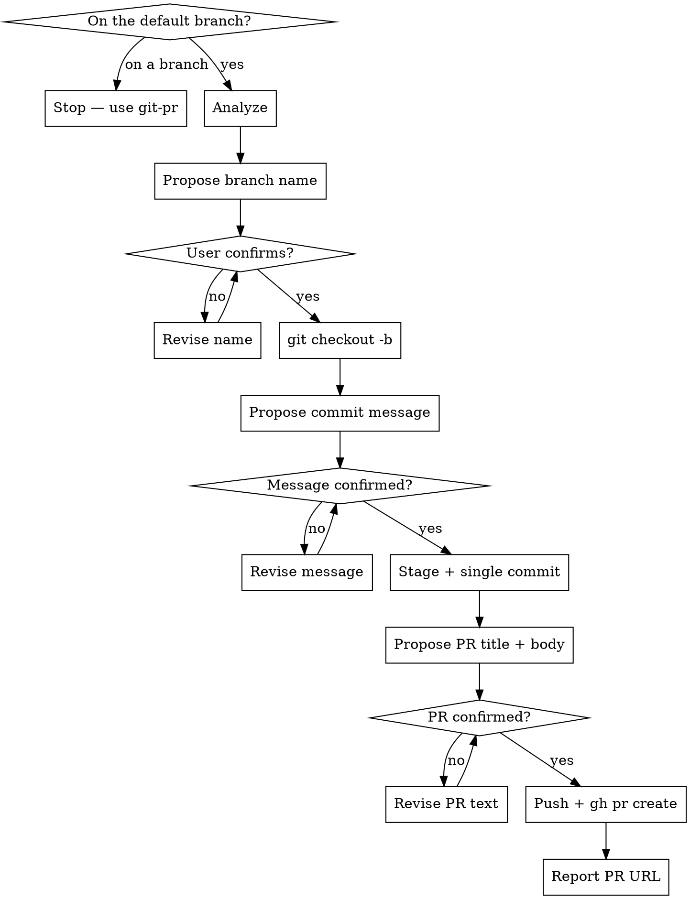

# Branch and PR

Take uncommitted changes sitting on the default branch, move them to a new feature branch as **one commit**, and open a pull request.

Related: `git-pr` opens a PR for a branch that already exists. `git-push-to-main` skips the PR entirely.

## Scripts

Helper scripts in `~/.claude/skills/git-branch-and-pr/scripts/`:

| Script | Purpose |
|--------|---------|
| `analyze-changes.sh` | Status, branch info, default-branch detection, diffs, untracked files, recent commits, README and PR template checks |
| `stage-files.sh [files\|--all]` | Stage files with sensitive-file warnings |
| `create-commit.sh <msg> [--amend]` | Create commit or amend previous (rejects AI attribution) |

## Workflow



## Steps

### Phase 0: Verify On the Default Branch

1. Check the current branch. If it is NOT the default branch (`main` or `master`), **stop immediately**:
   > "This skill only runs on the default branch. You're on `<branch>`. Use `git-pr` to open a PR for a branch that already has commits."

   Do not proceed.

### Phase 1: Analyze Repository State

2. Run the analysis script **from the repo root**:
   ```bash
   bash -c 'cd "$(git rev-parse --show-toplevel)" && bash ~/.claude/skills/git-branch-and-pr/scripts/analyze-changes.sh'
   ```

   It outputs git status and branch info, default-branch detection, staged and unstaged diffs, untracked files, recent commits (for style reference), and README / PR template existence.

### Phase 2: Propose and Create the Feature Branch

3. Generate a short, descriptive kebab-case branch name from the diff (e.g. `add-auth-middleware`, `fix-cache-eviction`).

4. **Propose the branch name** and ask: *"Use this branch name, or type a replacement?"* Wait for confirmation or a replacement. Never create the branch without it.

5. ```bash
   git checkout -b <branch-name>
   ```
   The uncommitted changes come with you — no stash needed.

### Phase 3: Review and Propose a Commit Message

6. Summarize the changes: what files changed, what the changes do.

7. **Auto-propose a commit message** based on the diff. Show it and ask: *"Use this commit message, or type a replacement?"* Wait for confirmation or a replacement.

8. If README.md exists, check whether the changes affect documented content and update it if so — only for meaningful user-visible changes.

### Phase 4: Stage and Commit (single commit)

9. Stage files:
   ```bash
   bash ~/.claude/skills/git-branch-and-pr/scripts/stage-files.sh --all
   ```
   Or name specific files.

10. Create the one commit:
    ```bash
    bash ~/.claude/skills/git-branch-and-pr/scripts/create-commit.sh "commit message here"
    ```
    The script rejects AI attribution.

### Phase 5: Propose the PR Title and Body

11. Gather context:
    ```bash
    git log --oneline $(git merge-base <default> HEAD)..HEAD
    git diff <default>...HEAD --stat
    ```
    Use **three-dot** (`<default>...HEAD`) — that is what GitHub shows in the PR.

12. Draft:
    - **Title**: under 70 chars, describes the purpose of the change
    - **Body** — use the repo's PR template if one exists, otherwise:
      ```
      ## Summary
      <1-3 bullets explaining what changed and why>

      ## Changes
      <grouped list of specific changes — by file or area>

      ## Test plan
      <how to verify this works — manual steps, test commands>
      ```

13. **Show the title and full body** and ask: *"Use this, or type a replacement?"* Wait for confirmation or edits before pushing anything.

### Phase 6: Push and Create the PR

14. Once confirmed:
    ```bash
    git push -u origin $(git branch --show-current)
    ```
    ```bash
    gh pr create --base <default> --title "<title>" --body-file <path>
    ```
    Write the confirmed body to a file rather than inlining a heredoc — it avoids quoting surprises in long bodies.

15. Output the PR URL.

## Rules

- Run only from the default branch — refuse in Phase 0 otherwise
- **Single commit**: this skill creates exactly one commit on the new branch. For more commits afterwards, use `git-push-branch` from that branch
- NEVER push or create the PR without asking for confirmation first
- NEVER include "Co-Authored-By" or any "Claude Code" / AI attribution in commits **or** in the PR body
- NEVER force-push
- Always propose the branch name and wait for confirmation before `git checkout -b`
- Always propose the commit message and wait for confirmation before committing
- Always propose the PR title and body and wait for confirmation before pushing
- The PR description must accurately reflect the full diff; group by area if the diff is large
- Keep Summary on the "why", Changes on the "what"
- Use conventional commit style if the repo uses it
- Only update README when changes meaningfully affect documented content
- Do not add `--draft` unless the user asks

## Common mistakes

- **Running this on a feature branch.** That is `git-pr`.
- **Two-dot vs three-dot diff.** Use `<default>...HEAD` to match what GitHub shows in the PR.
- **Fabricated description.** Summarize the real diff, not a guess at what the change probably does.
- **Creating the branch before confirming the name.** Renaming afterwards is avoidable churn.
- **Expecting multiple commits.** This skill makes exactly one.
- **Putting AI attribution in the PR body.** The commit script blocks it in commits; the same rule applies to anything published to GitHub.
