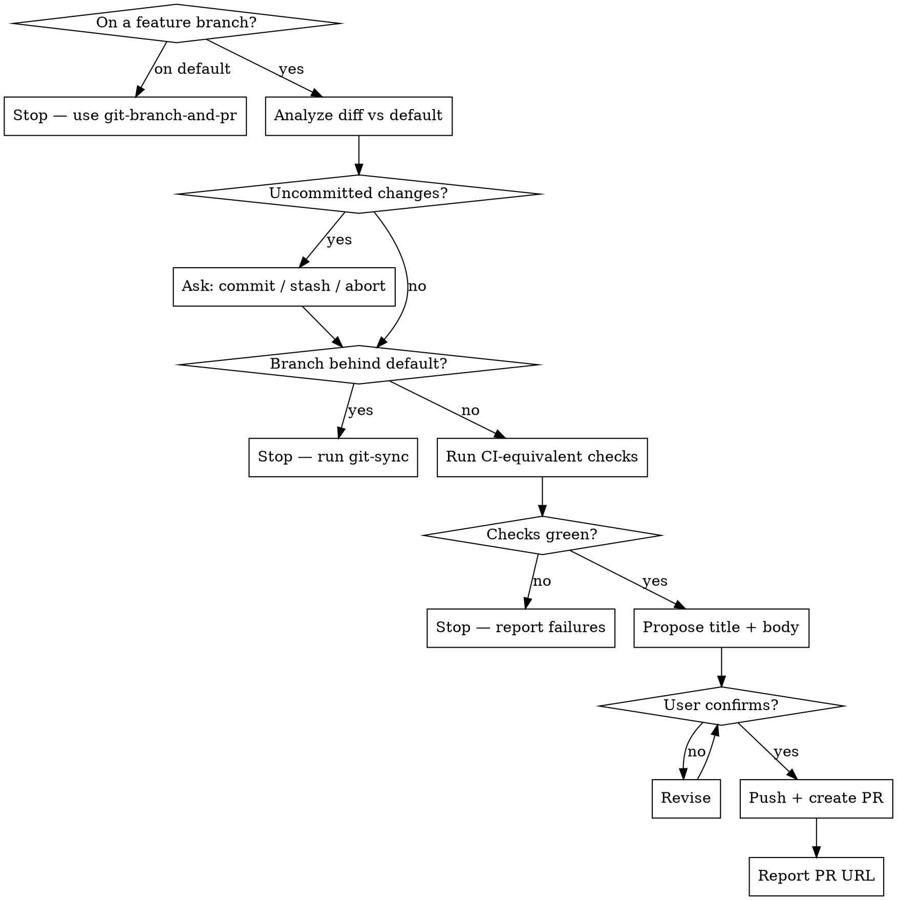

# PR From Branch

Take a feature branch from "I think it's done" to "PR is open and CI-ready": inspect everything that differs from the default branch, ensure nothing is uncommitted, run the checks CI will run, and only then open the PR with a description that reflects the actual diff.

**Do not open a PR on red.** If uncommitted work is unresolved, the branch is behind, or the local checks fail, stop and report. A PR opened on red just burns a CI cycle.

Use `git-branch-and-pr` instead when the work is still uncommitted on the default branch and needs a branch created for it.

## Scripts

Helper scripts in `~/.claude/skills/git-pr/scripts/`:

| Script | Purpose |
|--------|---------|
| `analyze-branch.sh` | Branch info, uncommitted work, three-dot PR diff, up-to-date check, existing-PR check, CI workflows, local check commands, PR template |
| `stage-files.sh [files\|--all]` | Stage files with sensitive-file warnings |
| `create-commit.sh <msg> [--amend]` | Create commit (rejects AI attribution) |
| `create-pr.sh <title> <body_file> [--draft]` | Push and open the PR (rejects AI attribution in title *and* body, refuses duplicates) |

## Workflow



## Steps

### Phase 1: Analyze the Branch

1. Run the analysis from the repo root:
   ```bash
   bash -c 'cd "$(git rev-parse --show-toplevel)" && bash ~/.claude/skills/git-pr/scripts/analyze-branch.sh'
   ```

2. Act on the exit code:

   | Exit | Meaning | What to do |
   |---|---|---|
   | 0 | Ready | Continue to Phase 3 |
   | 2 | On the default branch | Stop. Point the user at `git-branch-and-pr` |
   | 3 | No commits beyond the default branch | Stop. There is nothing to PR |
   | 4 | Blockers listed | Resolve them in Phase 2 |

3. Read the **three-dot** diff (`origin/<default>...HEAD`) closely enough to write an honest summary. Three-dot is exactly what GitHub shows in the PR — the diff against the merge-base — so a description built from it matches what a reviewer sees. Do not infer the summary from commit subjects alone.

   If the script reported the diff as too large to inline, read it per file:
   ```bash
   git diff origin/<default>...HEAD -- <path>
   ```

4. If the script reported an **existing PR**, do not create a duplicate. Report its URL and offer to update the body with `gh pr edit <n> --body-file <file>` instead.

### Phase 2: Clear the Blockers

5. **`uncommitted-changes`** — surface the exact files and ask the user with `AskUserQuestion`:

   | Option | Action |
   |---|---|
   | **Commit it** | Propose a message, get confirmation, then `stage-files.sh --all` + `create-commit.sh`; re-run Phase 1 |
   | **Leave it out** | `git stash push -u` so it is excluded from the PR; restore it after the PR is open |
   | **Abort** | Stop and let the user sort it out |

   Never silently commit or discard. Untracked files count as uncommitted.

6. **`behind-default-branch`** — stop and tell the user to run `git-sync` first. Do not open a PR from a stale branch: the diff will not reflect what actually merges, and many CI guards reject it outright.

### Phase 3: Run the CI-Equivalent Checks

7. Read the workflow files the analysis listed as triggering on `pull_request`, and run their equivalent locally using the check commands the script found (package.json scripts, Makefile targets, just recipes). Typically that means the lint, build, and test commands.

8. If any check fails, **STOP**. Report the failure output verbatim. Fix it or ask the user — do not push and open the PR.

   If the repo has no discoverable checks, say so plainly in the report rather than implying the PR was verified.

### Phase 4: Propose Title and Body

9. Draft:
   - **Title**: imperative, under 70 chars, scoped to the change (e.g. `fix(cache): evict stale entries on write`)
   - **Body** — use the repo's PR template if one exists, otherwise:
     ```
     ## Summary
     <1-4 bullets: what changed and why, grounded in the actual diff>

     ## Changes
     <notable files / areas touched, grouped by area if the diff is large>

     ## Test plan
     <the checks that were run and their result, plus anything verified manually>
     ```

10. **Show the title and full body to the user** and ask: *"Use this, or type a replacement?"* Wait for confirmation or edits before pushing anything.

### Phase 5: Push and Create

11. Write the confirmed body to a file, then create the PR:
    ```bash
    bash ~/.claude/skills/git-pr/scripts/create-pr.sh "<title>" /tmp/pr-body.md
    ```
    The script pushes the branch (setting upstream if needed), refuses duplicates, and rejects AI attribution in both the title and the body. Pass `--draft` only if the user asked for a draft.

12. If it exits **2**, a PR already existed — report that URL rather than treating it as a failure.

### Phase 6: Report

13. Give the user the PR URL, the branch, the commit count, and which checks were run and passed. If work was stashed in Phase 2, restore it now and say so.

    Do not merge — opening the PR is the end of this skill. When review is done, `git-merge-pr` merges it and `git-cleanup` tidies up afterwards.

## Rules

- Run only on a feature branch that already has commits — refuse in Phase 1 otherwise
- NEVER open a PR with uncommitted work unresolved or the branch behind the default branch
- NEVER open a PR when the local checks are failing
- NEVER include "Co-Authored-By" or any "Claude Code" / AI attribution in commits **or** in the PR title/body — `create-pr.sh` rejects it in both
- NEVER push or create the PR without showing the title and body and getting confirmation
- NEVER force-push
- Never create a duplicate PR — check first, update the existing one instead
- The PR description must accurately reflect the real diff; do not invent work that is not in it
- Keep Summary on the "why", Changes on the "what"
- Use conventional commit style if the repo uses it
- Do not add `--draft` unless the user asks

## Common mistakes

- **Opening a PR on red.** Run the Phase 3 checks first and stop on any failure.
- **Missing uncommitted work.** `git status --porcelain` — untracked files count too.
- **Two-dot vs three-dot diff.** Use `origin/<default>...HEAD` (three-dot) to match what GitHub shows. Two-dot compares against the moving tip and will misreport the change.
- **PRing a stale branch.** If the branch is behind, the diff is not what will merge.
- **Fabricated description.** Summarize the real diff, not the commit subjects or a guess.
- **Duplicate PR.** Check for an existing PR before creating one; re-running this skill must be safe.
- **Merging the PR.** This skill opens it; review and merge are someone else's job.
- **Claiming checks passed when none exist.** If the repo has no discoverable checks, say that instead.
