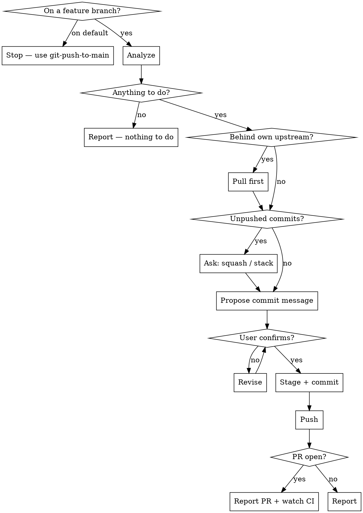

# Push Branch

Commit the current changes on a feature branch and push them. If a PR is open for the branch, this is what updates it.

This is the everyday loop: make a change, commit, push. Use it for review feedback and CI fixes on an existing PR.

Related: `git-commit` commits without pushing. `git-push-to-main` does the same job on the default branch. `git-pr` opens the PR in the first place.

## Scripts

Helper scripts in `~/.claude/skills/git-push-branch/scripts/`:

| Script | Purpose |
|--------|---------|
| `analyze-branch.sh` | Status, diffs, unpushed commits, upstream drift, behind-default check, **open PR and its CI checks** |
| `stage-files.sh [files\|--all]` | Stage files with sensitive-file warnings |
| `create-commit.sh <msg> [--amend]` | Create commit or amend (rejects AI attribution) |

## Workflow



## Steps

### Phase 1: Analyze

1. Run from the repo root:
   ```bash
   bash -c 'cd "$(git rev-parse --show-toplevel)" && bash ~/.claude/skills/git-push-branch/scripts/analyze-branch.sh'
   ```

2. Act on the exit code:

   | Exit | Meaning | What to do |
   |---|---|---|
   | 0 | Work to commit and/or push | Continue |
   | 2 | On the default branch | Stop. Point at `git-push-to-main` |
   | 3 | Clean tree, nothing unpushed | Report and stop |

3. Note from the output:
   - Whether the branch is **behind its own upstream** — someone else pushed to it. Pull before pushing or the push is rejected.
   - Whether an **open PR** exists, and the state of its CI checks.
   - Whether the branch is behind the default branch (not blocking; mention `git-sync` if CI needs it current).

### Phase 2: Pull If the Upstream Moved

4. If the analysis warned that the branch is behind its own upstream:
   ```bash
   git pull --ff-only
   ```
   If that cannot fast-forward, the branch has diverged from its remote. **Stop** — do not force anything. Surface it to the user; resolving it is `git-sync`'s conflict procedure, not a push.

### Phase 3: Handle Unpushed Commits

5. If there are already unpushed commits, ask with **`AskUserQuestion`**:
   - **Squash** — fold the new changes into the last commit with `--amend`
   - **Stack** — add a new commit on top

   (`AskUserQuestion` always offers Other, so the user can describe something else.)

   If the last commit was already pushed, an amend rewrites published history — pushing it needs `--force-with-lease`. Say so before choosing squash, and only force-push with explicit confirmation.

### Phase 4: Review and Propose a Message

6. Summarize what changed and why.

7. **Auto-propose a commit message.** Show the full message as text, then put it to the user with **`AskUserQuestion`** — use it, or reword it (they type the replacement via Other). Never commit without that answer.

   If this commit addresses review feedback, say what it addresses — reviewers read commit subjects.

### Phase 5: Stage and Commit

8. ```bash
   bash ~/.claude/skills/git-push-branch/scripts/stage-files.sh --all
   ```
   Or name specific files.

9. ```bash
   bash ~/.claude/skills/git-push-branch/scripts/create-commit.sh "commit message here"
   ```
   Add `--amend` for the squash case. The script rejects AI attribution.

### Phase 6: Push

10. ```bash
    git push
    ```
    If there is no upstream:
    ```bash
    git push -u origin $(git branch --show-current)
    ```
    If the commit was amended and the original was already pushed, **get an explicit go-ahead through `AskUserQuestion` first** — force-push with lease, or stop and leave it — then:
    ```bash
    git push --force-with-lease
    ```
    Never plain `--force`.

### Phase 7: Report

11. State the commit, the branch, and that it pushed. If a PR is open, give its URL and note that the push updated it.

    If the user was fixing red CI, offer to check the run once it starts:
    ```bash
    gh pr checks <n> --watch
    ```
    Only run that if the user asks — it blocks until CI finishes.

## Rules

- Run only on a feature branch — refuse on the default branch
- Pull before pushing when the branch is behind its own upstream; never force past a rejected push
- **Every decision goes through `AskUserQuestion`, never a question in prose.** A text question reads as a sign-off — the turn looks finished and the user can't tell anything is pending. The dialog renders as something to select and submit. Ordinary text is for showing the proposed message and for the final report
- Always propose the commit message and wait for the dialog answer (or their replacement) before committing
- NEVER include "Co-Authored-By" or any "Claude Code" / AI attribution — `create-commit.sh` rejects it
- NEVER force-push without explicit user confirmation, and never plain `--force`
- Warn before amending a commit that was already pushed — it rewrites published history
- Keep commit messages short and focused on the "why"
- Use conventional commit style if the repo uses it
- The stage-files.sh script warns about sensitive files (.env, .pem, .key, etc.) and does not stage them

## Common mistakes

- **Pushing without pulling when the remote branch moved.** The push is rejected, and the reflex fix — force — destroys someone else's commit.
- **Amending an already-pushed commit without saying so.** It rewrites published history and needs a force-push; reviewers lose the diff they were reading.
- **Using this on the default branch.** That is `git-push-to-main`, which has different guardrails.
- **Opening a second PR.** This skill pushes to the branch; the existing PR updates itself. Use `git-pr` only when there is no PR yet.
- **Blocking on `gh pr checks --watch` unprompted.** It waits for CI to finish. Only run it when asked.
- **Silently staging sensitive files.** Let `stage-files.sh` do the staging.
