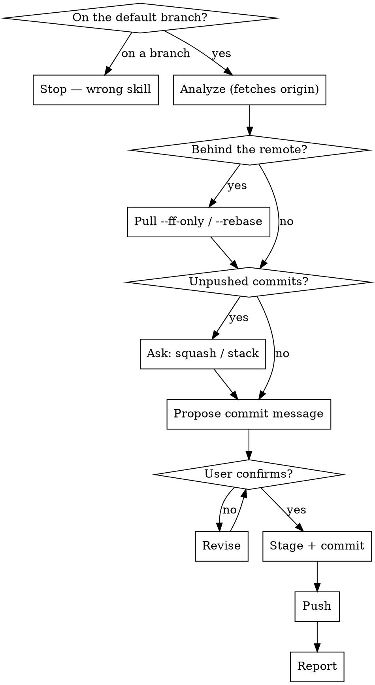

# Push to Main

Commit the current changes on the default branch and push directly to the remote. For verified work that does not need a PR.

Related: `git-push-branch` does the same job on a feature branch. `git-branch-and-pr` wraps default-branch changes into a PR instead.

## Scripts

Helper scripts in `~/.claude/skills/git-push-to-main/scripts/`:

| Script | Purpose |
|--------|---------|
| `analyze-changes.sh` | Status, **behind-remote check**, unpushed commits, diffs, recent commits, README check |
| `stage-files.sh [files\|--all]` | Stage files with sensitive-file warnings |
| `create-commit.sh <msg> [--amend]` | Create commit or amend previous (rejects AI attribution) |

## Workflow



## Steps

### Phase 0: Verify On the Default Branch

1. Check the current branch. If it is NOT the default branch (`main` or `master`), **stop immediately**:
   > "This skill only runs on the default branch. You're on `<branch>`. Use `git-push-branch` to commit and push there, `git-branch-and-pr` if you want a PR, or `git-sync` to bring main into this branch."

   Do not proceed.

### Phase 1: Analyze Repository State

2. Run the analysis script **from the repo root**:
   ```bash
   bash -c 'cd "$(git rev-parse --show-toplevel)" && bash ~/.claude/skills/git-push-to-main/scripts/analyze-changes.sh'
   ```

   It fetches origin, then reports status, whether you are **behind the remote**, unpushed commits, staged/unstaged diffs, untracked files, recent commits, and the README check.

### Phase 2: Pull If the Remote Moved

3. If the analysis printed a `BLOCKER: behind origin/<default>` line, someone else pushed since you last pulled. A plain `git push` will be rejected. Integrate first:

   ```bash
   git pull --ff-only          # no local commits yet — clean fast-forward
   ```

   If you already have local commits, the fast-forward fails. Then:

   ```bash
   git pull --rebase           # replay your local commits on top of the remote
   ```

   If the rebase conflicts, resolve each conflict **with the user**, one block at a time, exactly as `git-sync` describes — label the sides "your work" and "origin/main", never the raw `ours`/`theirs` words, which invert during a rebase. Verify no markers survive before continuing.

   Never force-push past a rejected push. The rejection is protecting someone else's commit.

### Phase 3: Handle Unpushed Commits

4. If there are unpushed commits, ask the user:
   - **Squash** — fold the new changes into the previous commit with `--amend`
   - **Stack** — add a new commit on top
   - **Other** — let the user specify

   Amending a commit that was already pushed rewrites published history and needs a force-push. Say so before choosing squash.

### Phase 4: Review and Propose a Commit Message

5. Summarize the changes: what files changed, what the changes do.

6. **Auto-propose a commit message** based on the diff. Show it and ask: *"Use this message, or type a replacement?"* Wait for the user to confirm or supply their own. Never commit without this step.

7. If README.md exists, check whether the changes affect documented content — new features, changed commands or structure, removed functionality. Update it only for meaningful user-visible changes.

### Phase 5: Stage and Commit

8. Stage files:
   ```bash
   bash ~/.claude/skills/git-push-to-main/scripts/stage-files.sh --all
   ```
   Or name specific files.

9. Create the commit with the confirmed message:
   ```bash
   bash ~/.claude/skills/git-push-to-main/scripts/create-commit.sh "commit message here"
   ```
   Add `--amend` for the squash case. The script refuses any message containing AI attribution.

### Phase 6: Push

10. ```bash
    git push
    ```
    If no upstream is configured:
    ```bash
    git push -u origin $(git branch --show-current)
    ```
    If the commit was amended and the original was already pushed, **ask the user for confirmation first**, then:
    ```bash
    git push --force-with-lease
    ```
    Never plain `--force`, and never onto a branch other people are working on.

### Phase 7: Report

11. State the commit, that it pushed, and the new remote HEAD. If Phase 2 pulled anything, say what came in.

## Rules

- Run only on the default branch — refuse in Phase 0 otherwise
- Pull before pushing when behind the remote; never force past a rejected push
- Always propose a commit message and get explicit confirmation (or a replacement) before committing
- NEVER include "Co-Authored-By" or any "Claude Code" / AI attribution — the script rejects it
- NEVER force-push without explicit user confirmation, and never plain `--force`
- Warn before amending a commit that was already pushed
- Keep commit messages short and focused on the "why"
- Use conventional commit style if the repo uses it
- Only update README when changes meaningfully affect documented content
- The stage-files.sh script warns about sensitive files (.env, .pem, .key, etc.) and does not stage them automatically

## Common mistakes

- **Pushing without pulling.** If anyone else pushed since your last pull, `git push` is rejected — and the reflex fix, force, destroys their commit. Phase 2 exists for this.
- **`git pull` without `--ff-only` or `--rebase`.** A plain pull invents a merge commit on the default branch when it has diverged.
- **Force-pushing the default branch.** Almost never correct. It rewrites history other people have already built on.
- **Amending an already-pushed commit silently.** It rewrites published history and needs a force-push.
- **Using this on a feature branch.** That is `git-push-branch`.
- **Pushing straight to main when the change wants review.** If it needs a second pair of eyes, use `git-branch-and-pr`.
